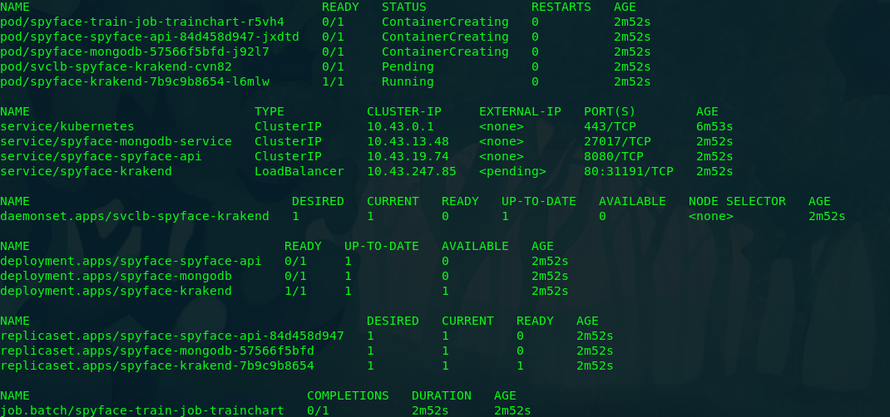

# SpyFace

## Descrição

O Spyface é um projeto desenvolvido para fins acadêmicos. Tem o objetivo de ser uma ferramenta para ajudar em operações de recuperação de fugitivos.

## Como executar localmente

Para utilizar o SpyFace localmente será necessário que você tenha algumas ferramentas instaladas em seu ambiente:

### Pré requisitos

* Docker
* k3d
* helm
* helmfile
* kubectl
* Postman (Ou similares, como insomnia. também pode ser utilizado wget ou curl. Por questões de praticidade usaremos o postman neste exemplo)

### Arquitetura da solução

Atualmente o projeto é composto basicamente pelo serviço de API Gateway utilizando o **Krakend**, o **MongoDB** como banco de dados para armazenar metadados, a **API** que recebe a imagem a ser comparada e retorna o *Score* construida em python com o **Fast API**, e o serviço de treino com o código de treinamento do **OpenCV** onde é gerado o artefato utilizado pela API. O diagrama abaixo exemplifica a interação entre os componentes.


### Iniciando o ambiente

Para iniciar o ambiente utilizando um cluster kubernetes com o k3d será necessário primeiramente criar o cluster com o comando abaixo:

```sh
$ k3d cluster create -p "80:80@loadbalancer"
```

Após a criação do cluster, entre no diretório **kubernetes/spyface** e execute o seguinte comando:

```sh
$ helmfile --log-level debug --environment dev --state-values-set name=spyface sync
```

Ao final da execução do comando helmfile acima os recursos necessários serão baixados e o deploy será executado. Para validar os recursos criados no seu cluster local execute o seguinte comando:

```sh
$ kubectl get all
```

A saída do comando deve ser parecida com a imagem abaixo:



### Enviando imagens via API

Substituia o **{{host}}** na url pelo ip externo do ingress, que você pode visualizar com o comando **kubectl get ingress**.

Para validar se a API está funcionando corretamente teste acessando a url http://{{host}}/spyface/v1/predict pelo seu navegador, ou envie uma requisição com a ferramenta que tiver acesso. O retorno deve ser similar ao json abaixo:

```json
{
    "status": "ok"
}
```

Com o serviço da API em execução abra o postman e crie uma requisição do tipo POST para a url http://localhost/predict. Na aba "Body" selecione "form-data", insira um campo chave nomeado "id" e adicione o valor 1, crie um novo campo e defina a chave como "file" e escolha o arquivo de imagem que será enviado para a API. A configuração deve ficar similar a seguinte:


Ao enviar a requisição será retornado o score relativo a confiança do fugitivo estar presente na imagem, como mostra o exemplo abaixo:


